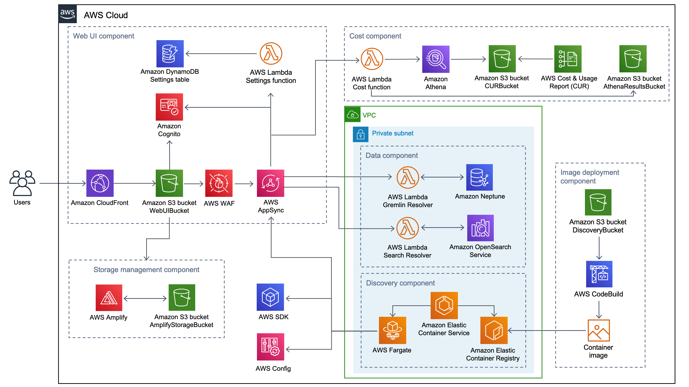

# Workload Discovery on AWS (v2.1.5)

Workload Discovery on AWS is a tool that quickly visualizes AWS Cloud workloads as architecture diagrams. 
You can use the solution to build, customize, and share detailed workload visualizations based on live data from AWS. 
This solution works by maintaining an inventory of the AWS resources across your accounts and Regions, 
mapping relationships between them, and displaying them in a web user interface (web UI).

To find out more about Workload Discovery visit our [AWS Solutions](https://aws.amazon.com/solutions/implementations/workload-discovery-on-aws) 
page.

## Launch Workload Discovery

| Region   |      Launch      |  Template Link |
|----------|:-------------:|:------:|
| US East (N. Virginia) (us-east-1) |[Launch](https://console.aws.amazon.com/cloudformation/home?region=us-east-1#/stacks/create/template?stackName=workload-discovery&templateURL=https://solutions-reference.s3.amazonaws.com/workload-discovery-on-aws/latest/workload-discovery-on-aws.template) | [Link](https://solutions-reference.s3.amazonaws.com/workload-discovery-on-aws/latest/workload-discovery-on-aws.template)|
| US East (Ohio) (us-east-2) |    [Launch](https://console.aws.amazon.com/cloudformation/home?region=us-east-2#/stacks/create/template?stackName=workload-discovery&templateURL=https://solutions-reference.s3.amazonaws.com/workload-discovery-on-aws/latest/workload-discovery-on-aws.template)   | [Link](https://solutions-reference.s3.amazonaws.com/workload-discovery-on-aws/latest/workload-discovery-on-aws.template) |
| US West (Oregon) (us-west-2) | [Launch](https://console.aws.amazon.com/cloudformation/home?region=us-west-2#/stacks/create/template?stackName=workload-discovery&templateURL=https://solutions-reference.s3.amazonaws.com/workload-discovery-on-aws/latest/workload-discovery-on-aws.template) | [Link](https://solutions-reference.s3.amazonaws.com/workload-discovery-on-aws/latest/workload-discovery-on-aws.template) |
| Asia Pacific (Mumbai) (ap-south-1) | [Launch](https://console.aws.amazon.com/cloudformation/home?region=ap-south-1#/stacks/create/template?stackName=workload-discovery&templateURL=https://solutions-reference.s3.amazonaws.com/workload-discovery-on-aws/latest/workload-discovery-on-aws.template) | [Link](https://solutions-reference.s3.amazonaws.com/workload-discovery-on-aws/latest/workload-discovery-on-aws.template)|
| Asia Pacific (Seoul) (ap-northeast-2) | [Launch](https://console.aws.amazon.com/cloudformation/home?region=ap-northeast-2#/stacks/create/template?stackName=workload-discovery&templateURL=https://solutions-reference.s3.amazonaws.com/workload-discovery-on-aws/latest/workload-discovery-on-aws.template) | [Link](https://solutions-reference.s3.amazonaws.com/workload-discovery-on-aws/latest/workload-discovery-on-aws.template) |
| Asia Pacific (Singapore) (ap-southeast-1) | [Launch](https://console.aws.amazon.com/cloudformation/home?region=ap-southeast-1#/stacks/create/template?stackName=workload-discovery&templateURL=https://solutions-reference.s3.amazonaws.com/workload-discovery-on-aws/latest/workload-discovery-on-aws.template) | [Link](https://solutions-reference.s3.amazonaws.com/workload-discovery-on-aws/latest/workload-discovery-on-aws.template) |
| Asia Pacific (Sydney) (ap-southeast-2) | [Launch](https://console.aws.amazon.com/cloudformation/home?region=ap-southeast-2#/stacks/create/template?stackName=workload-discovery&templateURL=https://solutions-reference.s3.amazonaws.com/workload-discovery-on-aws/latest/workload-discovery-on-aws.template) | [Link](https://solutions-reference.s3.amazonaws.com/workload-discovery-on-aws/latest/workload-discovery-on-aws.template)|
| Asia Pacific (Tokyo) (ap-northeast-1) | [Launch](https://console.aws.amazon.com/cloudformation/home?region=ap-northeast-1#/stacks/create/template?stackName=workload-discovery&templateURL=https://solutions-reference.s3.amazonaws.com/workload-discovery-on-aws/latest/workload-discovery-on-aws.template) |[Link](https://solutions-reference.s3.amazonaws.com/workload-discovery-on-aws/latest/workload-discovery-on-aws.template) |
| Canada (Central) (ca-central-1) | [Launch](https://console.aws.amazon.com/cloudformation/home?region=ca-central-1#/stacks/create/template?stackName=workload-discovery&templateURL=https://solutions-reference.s3.amazonaws.com/workload-discovery-on-aws/latest/workload-discovery-on-aws.template) | [Link](https://solutions-reference.s3.amazonaws.com/workload-discovery-on-aws/latest/workload-discovery-on-aws.template) |
| Europe (Ireland) (eu-west-1) | [Launch](https://console.aws.amazon.com/cloudformation/home?region=eu-west-1#/stacks/create/template?stackName=workload-discovery&templateURL=https://solutions-reference.s3.amazonaws.com/workload-discovery-on-aws/latest/workload-discovery-on-aws.template) | [Link](https://solutions-reference.s3.amazonaws.com/workload-discovery-on-aws/latest/workload-discovery-on-aws.template) |
| Europe (London) (eu-west-2) | [Launch](https://console.aws.amazon.com/cloudformation/home?region=eu-west-2#/stacks/create/template?stackName=workload-discovery&templateURL=https://solutions-reference.s3.amazonaws.com/workload-discovery-on-aws/latest/workload-discovery-on-aws.template) | [Link](https://solutions-reference.s3.amazonaws.com/workload-discovery-on-aws/latest/workload-discovery-on-aws.template) |
| Europe (Frankfurt) (eu-central-1)| [Launch](https://console.aws.amazon.com/cloudformation/home?region=eu-central-1#/stacks/create/template?stackName=workload-discovery&templateURL=https://solutions-reference.s3.amazonaws.com/workload-discovery-on-aws/latest/workload-discovery-on-aws.template) | [Link](https://solutions-reference.s3.amazonaws.com/workload-discovery-on-aws/latest/workload-discovery-on-aws.template) |
| Europe (Paris) (eu-west-3)| [Launch](https://console.aws.amazon.com/cloudformation/home?region=eu-west-3#/stacks/create/template?stackName=workload-discovery&templateURL=https://solutions-reference.s3.amazonaws.com/workload-discovery-on-aws/latest/workload-discovery-on-aws.template) | [Link](https://solutions-reference.s3.amazonaws.com/workload-discovery-on-aws/latest/workload-discovery-on-aws.template) |
| Europe (Stockholm) (eu-north-1)| [Launch](https://console.aws.amazon.com/cloudformation/home?region=eu-north-1#/stacks/create/template?stackName=workload-discovery&templateURL=https://solutions-reference.s3.amazonaws.com/workload-discovery-on-aws/latest/workload-discovery-on-aws.template) | [Link](https://solutions-reference.s3.amazonaws.com/workload-discovery-on-aws/latest/workload-discovery-on-aws.template) |
| South America (Sao Paulo) (sa-east-1) | [Launch](https://console.aws.amazon.com/cloudformation/home?region=sa-east-1#/stacks/create/template?stackName=workload-discovery&templateURL=https://solutions-reference.s3.amazonaws.com/workload-discovery-on-aws/latest/workload-discovery-on-aws.template) | [Link](https://solutions-reference.s3.amazonaws.com/workload-discovery-on-aws/latest/workload-discovery-on-aws.template) |

## Installation

Workload Discovery is deployed to your account using an AWS CloudFormation template and should take approximately 30 
minutes to deploy. See the [deployment guide](https://docs.aws.amazon.com/solutions/latest/workload-discovery-on-aws/automated-deployment.html) 
for instructions, and [the cost overview](https://docs.aws.amazon.com/solutions/latest/workload-discovery-on-aws/overview.html#cost) 
to learn about costs.

## Usage

A web interface is included with Workload Discovery. Refer to the [documentation](https://awslabs.github.io/workload-discovery-on-aws) 
to learn how to use the application.

## Feature requests

To submit an idea for a feature you would like to see implemented, please [create an issue](https://github.com/awslabs/workload-discovery-on-aws/issues) and use the 'enhancement' label. Your issue will be available on the [project board](https://github.com/awslabs/workload-discovery-on-aws/projects/2) for others to vote on.

## Architecture



Workload Discovery is deployed to your account using an AWS CloudFormation template consisting of six components. 
The following is a high level overview of the components. For additional details about each component, refer to 
the [Solution components guide](https://docs.aws.amazon.com/solutions/latest/workload-discovery-on-aws/solution-components.html).

The web user interface (UI) interacts with the data component via [AWS AppSync](http://aws.amazon.com/appsync/). The 
web UI requests resource relationship data from the data component. The data component queries and returns data 
from an [Amazon Neptune](http://aws.amazon.com/neptune/) database.

The storage management component stores user preferences and saved architecture diagrams. This is implemented using 
[AWS Amplify](http://aws.amazon.com/amplify/) and an [Amazon Simple Storage Service](http://aws.amazon.com/s3/) 
(Amazon S3) bucket.

The discovery component uses [AWS Config](http://aws.amazon.com/config) and AWS API calls to maintain an inventory of 
resource data from imported accounts and Regions, then stores its findings in the data component. This runs every 15 
minutes as a container task on [Amazon Elastic Container Service (Amazon ECS)](https://aws.amazon.com/ecs/) using the 
[AWS Fargate](http://aws.amazon.com/fargate/) launch type. The discovery component container image is built in the 
image deployment component using [AWS CodePipeline](http://aws.amazon.com/codepipeline/) and [AWS CodeBuild](http://aws.amazon.com/codebuild/).

The cost component processes [AWS Cost and Usage Reports](https://docs.aws.amazon.com/cur/latest/userguide/what-is-cur.html) 
(AWS CUR) to make cost data available in Workload Discovery. To use this feature, you must [create a report in AWS CUR](https://docs.aws.amazon.com/cur/latest/userguide/cur-create.html) 
to deliver the reports to the ```CostAndUsageReportBucket``` Amazon S3 bucket. When an AWS CUR is delivered, it 
triggers an [AWS Lambda](http://aws.amazon.com/lambda) function to trigger a AWS Glue Crawler that will update a 
table ready for Amazon Athena to query. You can query these AWS CURs via the Perspectie UI. You can bring in cost 
data from other accounts discoverable to Workload Discovery by setting up a AWS CUR and setting up replication between 
the S3 bucket in the discoverable account and the ```CostAndUsageReportBucket```


## Development
### Directory structure

```
|-deployment/
  |-build-s3-dist.sh             [ shell script for packaging distribution assets ]
  |-run-unit-tests.sh            [ shell script for executing unit tests ]
|-source/
  |-frontend/                    [ the frontend ui code ]
  |-backend/                     [ the backend code ]
    |-discovery/                 [ the code for the discovery process ]
    |-functions/                 [ the code for the Lambda functions ]
  |-cfn/                         [ the CloudFormation templates that deploy workload-discovery-on-aws ]
```

### Running the Workload Discovery Web Application locally

For development and debugging, it's possible to run the Workload Discovery UI locally.
The Workload Discovery solution must already be deployed to an account.

The Workload Discovery solution generates a `settings.js` file used by the web browser for configuration.
To develop locally, this `settings.js` file must be present.

- Copy the `settings.js` file from the S3 Bucket containing the Workload Discovery UI. This has the logical name `WebUIBucket` in the CloudFormation stack.
- Place the `settings.js` file in `source/frontend/public`.
- From the `source/frontend` directory, run `npm install`
- Run `npm run start` to run the local development server.

### Running unit tests

1. [AWS CLI](https://docs.aws.amazon.com/cli/latest/userguide/install-cliv2.html) installed.
2. [Node.js](https://nodejs.org/en/) installed
3. [Python 3](https://www.python.org/downloads/) installed
4. [Pipenv](https://pipenv.pypa.io/en/latest/) installed

```sh
cd ./deployment
./run-unit-tests.sh
```

### Deploying a local build

When you have made changes to the code, you can build it locally and upload the deployment artefacts to Amazon S3 by 
editing and running the bash script referenced below.

#### Prerequistes

1. [AWS CLI](https://docs.aws.amazon.com/cli/latest/userguide/install-cliv2.html) installed.
2. [Node.js](https://nodejs.org/en/) installed
3. [Python 3](https://www.python.org/downloads/) installed
4. The CLI [configured](https://docs.aws.amazon.com/cli/latest/reference/configure/) with credentials/profile that will allow:
   * S3 Bucket creation
   * S3 Object creation

#### Create deployment script

1. Copy the `deployment/local-deploy-script.sh.example` script to the root project directory.
  ```cp deployment/local-deploy-script.sh.example local-deploy-script.sh```
2. Edit the `local-deploy-script.sh` copy made in step 1. Substitute the value placeholders (marked with angle brackets)
with your own values, then save the script.
3. Make the script executable
   ```chmod +x ./local-deploy-script.sh```
4. Run the script
   ```./local-deploy-script.sh```

This will:

* Create S3 buckets to store the deployment artefacts.
* Run the build
* Deploy artefacts to your chosen S3 Bucket.

#### Deploying the CloudFormation template

Once you have the deployment artefacts in S3, you can deploy the **workload-discovery-on-aws.template** in the CloudFormation 
console. Just pass the link to the template in S3 to CloudFormation and it will do the rest.

Parameters required by the template:

* **Stack Name** - The name given to the deployment stack e.g. workload-discovery
* **AdminUserEmailAddress** - The email address to receive login credentials at.
* **AlreadyHaveConfigSetup** - Yes/No depending on whether AWS Config has is configured in the deployment Region.
* **CreateOpensearchServiceRole** - Yes/No depending on whether you already have this service-role created. You can check in the IAM console to see if it is provisioned.
* **CreateNeptuneReplica** - Yes/No depending on whether you want a read-replica created for Amazon Neptune. Note, that this will increase the cost of running the solution.
* **NeptuneInstanceClass** - Select from a range of instance types that will be provisioned for the Amazon Neptune database. Note, the selection could increase the cost associated with running the solution.
* **OpensearchInstanceType** - Select the instance type that will be provisioned for the Amazon ElasticSearch Domain.
* **AthenaWorkgroup** - The Workgroup that will be used to issue the Athena query when the Cost feature is enabled.
* **OpensearchMultiAz** - Choose whether to create an Opensearch cluster that spans multiple Availability Zone. Choosing Yes improves resilience; however, increases the cost of this solution.
  
**Note** - You will need to deploy in the same account and region as the S3 bucket that the deployment artefacts are uploaded to.

## Troubleshooting
If you encounter problems during or after the deployment of Workload Discovery, consult the [debugging flow](./debugging-flowchart.mmd) chart to help 
diagnose and rectify common issues.

## License

See license [here](./LICENSE.txt).

## Anonymized data collection

This solution collects anonymized operational metrics to help AWS improve the quality and features of the solution. 
For more information, including how to disable this capability, please see the [Implementation Guide](https://docs.aws.amazon.com/solutions/latest/workload-discovery-on-aws/collection-of-operational-metrics.html).

## Acknowledgements

AWS Workload Discovery is able to generate its architecture diagrams thanks to these libraries developed and maintained 
by the [Info Visualization Research Lab](https://www.cs.bilkent.edu.tr/~ivis/) at Bilkent University:

* [cytoscape.js-fcose](https://github.com/iVis-at-Bilkent/cytoscape.js-fcose)
* [cytoscape.js-grid-guide](https://github.com/iVis-at-Bilkent/cytoscape.js-grid-guide)
* [cytoscape.js-context-menus](https://github.com/iVis-at-Bilkent/cytoscape.js-context-menus)
* [cytoscape.js-expand-collapse](https://github.com/iVis-at-Bilkent/cytoscape.js-expand-collapse)


Copyright 2022 Amazon.com, Inc. or its affiliates. All Rights Reserved.

Licensed under the Apache License Version 2.0 (the "License"). You may not use this file except in compliance with the License. A copy of the License is located at https://www.apache.org/licenses/ or in the "[license](LICENSE.txt)" file accompanying this file. This file is distributed on an "AS IS" BASIS, WITHOUT WARRANTIES OR CONDITIONS OF ANY KIND, express or implied. See the License for the specific language governing permissions and limitations under the License.
